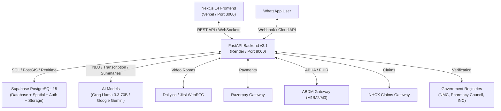

# CallMedex — Master System Architecture & Complete Platform Specification
**Version:** 3.1.0 (Next-Gen Production Architecture)  
**Author:** CallMedex Technical Team / ZukoLabs  
**Target Audience:** AI Models (Claude/GPT/Gemini), System Architects, & Core Software Engineers  

---

## EXECUTIVE SUMMARY & PRODUCT VISION

### 1. Product Identity & Purpose
**CallMedex** is an AI-native multi-sided healthcare services marketplace and orchestration platform tailored for the Indian healthcare ecosystem (and expandable globally). It applies real-time dispatch and dark-store fulfillment mechanics (similar to Uber/Blinkit) to medical services:
- **Phlebotomist & Home Nurse Dispatch:** Live GPS matching, nearest available route dispatch, live ETA countdown, and specimen chain-of-custody tracking.
- **Diagnostic Slot Booking:** Capacity-aware scheduling for lab-mandatory imaging (MRI, CT, X-Ray).
- **Pharmacy Delivery:** Dark-store geofenced pharmacy fulfillment with AI-driven drug safety checks.
- **Telemedicine & Video Consultation:** Daily.co/Jitsi WebRTC calls embedded directly in UI, compliant with NMC 2026 Regulations (mandatory generic drug names, Schedule H/H1 ID uploads, digital consent, Schedule X restriction), live translated captions, and AI voice scribe.
- **ABDM-First Integration:** Ayushman Bharat Digital Mission (M1: ABHA creation/lookup, M2: HIP FHIR R4 record pushing, M3: HIU cross-facility record pulling, DHIS incentive tracking).
- **NHCX Claims Gateway:** National Health Claims Exchange integration for pre-consult eligibility check, automated FHIR R4 claims processing, and AB-PMJAY cashless flow.
- **WhatsApp Dual Front-Door:** Web app and Meta WhatsApp Cloud API sharing the same Supabase backend and session state.

---

## 2. SYSTEM ARCHITECTURE & TECH STACK

### Stack Breakdown:
1. **Frontend:**
   - **Framework:** Next.js 14+ (App Router, TSX, React 18)
   - **Styling:** Tailwind CSS, custom glassmorphism & dark/light theme systems
   - **State & Maps:** React Hooks, Leaflet / Geoapify Maps for live dispatch & location picking
   - **Voice & Media:** Web Speech API (for voice intake), MediaRecorder API, Daily.co / Jitsi React WebRTC SDKs
2. **Backend:**
   - **Framework:** Python 3.11+ FastAPI
   - **Async I/O:** `asyncio`, Uvicorn ASGI Server, GZip Middleware, Security & Rate Limit Middlewares
   - **Data Validation:** Pydantic v2 models
   - **Database Client:** Supabase Client & PostgREST / SQLAlchemy for spatial and raw SQL queries
3. **Database Layer:**
   - **Engine:** PostgreSQL 15+ hosted on Supabase
   - **Spatial Extension:** PostGIS (`ST_DWithin`, `ST_Distance`, `GEOGRAPHY(POINT, 4326)`)
   - **Security:** Row Level Security (RLS) policies scoped by user roles and tenant scopes
4. **AI & LLM Services:**
   - **Groq API:** Llama 3.3-70b-versatile for fast NLU, WhatsApp chat parsing, live translation captions, consultation summaries, and e-prescription extraction.
   - **Google Gemini API:** Gemini 1.5 / 3.6 Flash for document OCR (prescriptions, medical licenses, diagnostic PDFs) and clinical interpretation.
5. **External Services:**
   - **ABDM Gateway:** `https://sandbox.abdm.gov.in` (M1 ABHA, M2 HIP, M3 HIU)
   - **NHCX Claims Gateway:** FHIR R4 claim creation & status tracking
   - **Telephony & Comms:** Exotel API for masked calling (patient-provider privacy), Resend / SMTP for transactional email notifications.

---

## 3. MULTI-ROLE ACCOUNT SYSTEM & VERIFICATION PIPELINE

CallMedex supports **8 distinct user roles** through a single native form with conditional branching:

| Role | Key Data Fields & Profile Table | Required Documents / Verification | Key Capabilities |
|---|---|---|---|
| **Patient** | `patients` table: blood group, height, weight, medical history chips, ABHA #, preferred language, insurance info | Aadhaar / Mobile OTP (for ABHA linkage) | Book phlebo/nurse home care, diagnostic slots, order medicine, video consult, view health records, track claims. |
| **Doctor** | `doctors` table: license #, specialization, qualification, years experience, fee, online availability, consultation slots | Medical license, certificate, ID proof -> NMC Registry API check | Conduct teleconsultations, draft AI summaries/e-prescriptions, review AI report interpretations. |
| **Phlebotomist** | `phlebotomists` table: duty status (`on_duty`/`off_duty`), vehicle details, MLT/DMLT cert # | Aadhaar, MLT/DMLT certificate -> OCR + cert cross-check | Live GPS location ping (10-15s interval), accept/reject dispatch jobs, update specimen chain-of-custody. |
| **Nurse** | `nurses` table: nursing cert #, experience, specializations (wound care, IV, vitals) | Nursing license -> INC (Indian Nursing Council) API check | Receive home care dispatch requests, perform home nursing visits, record patient vitals. |
| **Pharmacy** | `pharmacies` table: pharmacy type, drug license #, GST #, service radius (km), 24x7 toggle | Drug license, GST cert, pharmacist cert | Receive geofenced delivery orders, verify stock, dispatch order, manage inventory. |
| **Organization** | `organizations` table: org type (hospital/poly-clinic/lab), license #, head of inst, departments | Municipal health license, registration cert | Manage diagnostic slots, manage organization staff, claim DHIS incentives. |
| **Staff** | `staff` table: org_id, department, role title | Aadhaar, degree cert | Attached to an organization to operate internal dashboards. |
| **Admin / Supervisor** | `users` table (`role='admin'` or `role='supervisor'`) | System assigned | Verify pending provider registrations, monitor dispatch heatmaps, review fraud scores, view system analytics. |

### Verification Pipeline (`backend/app/services/verification.py`):
1. **Document Upload:** Provider submits license/ID PDF/image during signup.
2. **OCR Extraction:** Gemini/Groq Vision extracts Name, License Number, Issue Date, Expiry Date, Issuing Authority.
3. **Registry Cross-Check:** CallMedex queries Government APIs (NMC API for doctors, Drug Control API for pharmacies, Nursing Council API for nurses) or uses mock verification rules if `USE_MOCK_GOV_API=true`.
4. **Automated Status Assignment:**
   - `verified`: License valid and name match > 85%.
   - `flagged`: Expiry date passed or name mismatch — sent to Admin queue.
   - `rejected`: License number not found in registry.

---

## 4. DETAILED FEATURE MODULES & WORKFLOWS

### Module 1: ABDM & ABHA National Health Integration (`backend/app/services/abdm.py` & `fhir.py`)
- **M1 (Patient Identity):** Patient Enters Aadhaar/Mobile -> OTP sent via ABDM Sandbox Gateway -> Demographic prefill -> ABHA ID & `abha_ref_id` saved to `patients` table.
- **M2 (HIP - Health Information Provider):** Every generated lab report, e-prescription, or consultation summary is wrapped into a standardized **FHIR R4 Bundle** (`Bundle`, `Composition`, `Patient`, `Practitioner`, `MedicationRequest`, `DiagnosticReport`) and pushed to the ABDM gateway.
- **M3 (HIU - Health Information User):** Patient dashboard can request past medical records from external ABDM-compliant hospitals/labs via ABDM Consent Manager.
- **DHIS Tracker:** Platform records digital transactions to enable partner clinics to claim NHA Digital Health Incentive Scheme funds automatically.

### Module 2: Real-time Dispatch Engine (`backend/app/services/dispatch_engine.py` & `routers/dispatch.py`)
1. **Duty Activation:** Phlebotomist/Nurse toggles `is_on_duty = True` in app.
2. **Location Tracking:** Frontend/App pings live lat/long to `/api/dispatch/location` every 10–15 seconds, stored in `phlebotomist_locations` with PostGIS point geometry.
3. **Job Dispatch Trigger:** Patient requests home sample collection / nursing care.
4. **Spatial Matching (`ST_DWithin`):** Query finds all `on_duty` providers within `max_radius_km` (default 10km).
5. **Candidate Scoring Algorithm:**
   $$\text{Score} = (w_1 \times \text{Distance}) + (w_2 \times \text{ActiveJobs}) - (w_3 \times \text{Rating})$$
6. **Live Tracking UI:** Patient screen subscribes to location updates, rendering Leaflet map with provider marker, distance, and live ETA.
7. **Specimen Chain-of-Custody:**
   - Step 1: Phlebotomist scans barcode on sample vial at patient home (`status = collected`).
   - Step 2: Handoff scan to courier/rider (`status = in_transit`).
   - Step 3: Diagnostic Lab receiving scan (`status = lab_received`).

### Module 3: Geofenced Dark-Store Pharmacy Engine (`backend/app/routers/pharmacy_orders.py`)
- Customer submits prescription or OTC items with delivery address coordinates.
- System queries `pharmacies` where `ST_DWithin(pharmacy.location, patient.location, pharmacy.service_radius_km * 1000)` is true.
- Order is broadcasted to eligible pharmacies. First pharmacy to accept locks the order.
- **DrugShield Modal (`frontend/src/app/components/DrugShieldModal.tsx`):** AI checks active cart items against patient's existing active prescriptions and medical history for:
  - Drug-Drug Interactions (e.g., Warfarin + Aspirin risk)
  - Duplicate Therapy Warnings
  - Allergy & Contraindication Warnings

### Module 4: Telemedicine & Video Consultation (`backend/app/routers/telemedicine.py`)
- **Video Engine:** Integrates Daily.co REST API or Jitsi Meet to instantiate private, ephemeral WebRTC video rooms per `consultation_id`.
- **NMC 2026 Telemedicine Compliance:**
  1. *Generic Name Mandate:* AI prescription parser auto-converts brand names to generic chemical names.
  2. *Schedule H/H1 Safeguard:* Patient must upload Govt ID before Schedule H/H1 drugs can be finalized.
  3. *Digital Consent:* 3-year consent log stored in database with timestamp & patient IP.
  4. *Schedule X Hard Block:* Prescribing Schedule X / psychotropic substances via telemedicine is blocked by server validation.
- **Live Translated Captions:** Doctor's audio is transcribed via STT and translated in real-time using Groq Llama 3.3-70b, pushing captions to the patient UI in their chosen preferred language (e.g., Telugu, Hindi, Tamil).
- **AI Voice Intake Scribe (`frontend/src/app/components/AIVoiceIntakeModal.tsx`):** Allows patients to speak their symptoms in natural speech; Web Speech API + Gemini parses chief complaints into structured clinical notes for the doctor.

### Module 5: Interactive Body Map (`frontend/src/app/components/InteractiveBodyMap.tsx`)
- Interactive SVG/Canvas human body map (Head, Chest, Abdomen, Joints, Back, Arms, Legs, Skin).
- Patient taps body region -> Selects specific symptoms (e.g., Abdomen -> Sharp Pain, Nausea) -> System pre-filters relevant doctors, diagnostic tests, or emergency level.

### Module 6: AI Report Interpretation (`backend/app/routers/ai_reports.py`)
- Patient uploads lab PDF / diagnostic report.
- Gemini Vision / OCR extracts test parameters, values, unit measure, and reference ranges.
- Outputs dual summary:
  1. *Patient View:* Simple, non-alarmist plain-language explanation in patient's preferred language.
  2. *Doctor View:* Clinical bullet points highlighting flagged out-of-range values.

### Module 7: NHCX Insurance & Claims Gateway (`backend/app/routers/insurance.py`)
- Pre-consult insurance policy verification against NHCX gateway.
- Auto-generation of FHIR R4 Claim Bundles upon service completion.
- Claim tracking status lifecycle: `submitted` -> `under_review` -> `approved` -> `disbursed`.

### Module 8: WhatsApp Dual Front-Door (`backend/app/routers/whatsapp.py`)
- Webhook endpoint receives incoming WhatsApp text / voice messages.
- Groq Llama 3.3-70b NLU identifies user intent: `book_doctor`, `track_sample`, `order_medicine`, `view_report`.
- Executes exact same backend service functions as web frontend, keeping database state 100% unified.

---

## 5. DATABASE SCHEMA SUMMARY

The database is built on **Supabase PostgreSQL 15** with `postgis` enabled. Key table structures include:

- `users` (id, email, phone, role, full_name, is_active, is_verified, created_at)
- `patients` (id, user_id, dob, gender, blood_group, height, weight, medical_history, abha_number, abha_ref_id, preferred_language, address_json)
- `doctors` (id, user_id, license_number, specialization, qualification, experience_years, consultation_fee, is_online_available, nmc_verified)
- `phlebotomists` (id, user_id, qualification, cert_number, is_on_duty, current_lat, current_lng, vehicle_type, verified)
- `nurses` (id, user_id, cert_number, specializations, is_on_duty, current_lat, current_lng, verified)
- `pharmacies` (id, user_id, pharmacy_name, license_number, gst_number, service_radius_km, lat, lng, is_24x7)
- `organizations` (id, user_id, org_name, org_type, license_number, head_of_inst, address_json)
- `bookings` (id, patient_id, provider_id, service_type, status, scheduled_time, amount, payment_status, location_json, tracking_code)
- `phlebotomist_locations` (id, phlebotomist_id, location GEOGRAPHY(POINT, 4326), updated_at)
- `pharmacy_orders` (id, patient_id, pharmacy_id, items_json, status, prescription_url, total_amount, delivery_address)
- `prescriptions` (id, consultation_id, doctor_id, patient_id, medicines_json, diagnosis, generic_compliance_verified, pdf_url)
- `telemedicine_sessions` (id, booking_id, doctor_id, patient_id, room_name, room_url, consent_signed, duration_seconds, summary_json)
- `nhcx_claims` (id, booking_id, patient_id, insurer_id, fhir_claim_bundle, claim_status, amount_claimed, amount_approved)
- `audit_logs` (id, user_id, action, ip_address, timestamp, metadata)

---

## 6. COMPLETE API ENDPOINTS REFERENCE MAP

| Module | Method | Path | Description |
|---|---|---|---|
| **Auth** | POST | `/api/auth/signup` | Universal role-based signup |
| **Auth** | POST | `/api/auth/login` | Login & receive JWT access token |
| **Auth** | POST | `/api/auth/magic-link` | Passwordless magic link login |
| **Providers** | GET | `/api/providers/doctors` | List & filter doctors by specialization/fee |
| **Providers** | GET | `/api/providers/pharmacies` | List nearby pharmacies within radius |
| **Bookings** | POST | `/api/bookings/create` | Create booking (home collection, slot, teleconsult) |
| **Bookings** | GET | `/api/bookings/my-bookings` | List patient/provider bookings |
| **Dispatch** | POST | `/api/dispatch/location` | Update phlebotomist/nurse live GPS coordinates |
| **Dispatch** | POST | `/api/dispatch/assign` | Auto-assign nearest available provider |
| **Dispatch** | GET | `/api/dispatch/track/{booking_id}` | Live tracking telemetry for patient map |
| **Pharmacy** | POST | `/api/pharmacy/orders` | Create pharmacy order |
| **Pharmacy** | POST | `/api/pharmacy/drug-shield-check` | Run AI drug safety & interaction check |
| **Telemed** | POST | `/api/telemed/create-room` | Provision Daily.co/Jitsi video room |
| **Telemed** | POST | `/api/telemed/finalize` | Finalize consult, run AI summary & generic e-prescription |
| **AI Reports** | POST | `/api/reports/analyze` | OCR & interpret lab PDF reports |
| **Insurance** | POST | `/api/insurance/verify-eligibility` | Query NHCX insurance policy coverage |
| **Insurance** | POST | `/api/insurance/submit-claim` | Submit FHIR R4 insurance claim |
| **WhatsApp** | POST | `/api/whatsapp/webhook` | Process Meta WhatsApp Cloud API webhooks |
| **Verification**| POST | `/api/verification/verify` | Trigger automated OCR + Registry license check |
| **Payments** | POST | `/api/payments/create-order` | Create Razorpay payment order |
| **Payments** | POST | `/api/payments/verify` | Verify Razorpay payment signature |

---

## 7. KEY CODEBASE FILE MAP

- `backend/app/main.py` — FastAPI application entry point, CORS, Timeout & Security Middlewares.
- `backend/app/config.py` — Central Settings & Environment Variable Loader.
- `backend/app/routers/` — 16 REST API routers (Auth, Bookings, Dispatch, Telemedicine, Pharmacy, AI, etc.).
- `backend/app/services/` — 24 Service engines (ABDM, Dispatch Engine, Drug Shield, Government Verification, AI OCR, Voice Scribe, Telephony).
- `database/schema.sql` & `complete_supabase_schema.sql` — Core database tables, indices, and PostGIS queries.
- `frontend/src/app/` — Next.js 14 App Router pages (Dashboard, Consultations, Diagnostics, Dispatch, Booking, Pharmacy).
- `frontend/src/app/components/` — Next-gen interactive UI modals:
  - `AIVoiceIntakeModal.tsx` — AI Voice Scribe modal
  - `DrugShieldModal.tsx` — Drug Interaction AI modal
  - `InteractiveBodyMap.tsx` — 3D/2D anatomical symptom map
  - `NurseToolsModal.tsx` & `PhlebotomistToolsModal.tsx` — Field staff toolkits
  - `SmartNavbar.tsx` — Dynamic role-aware navigation bar

---

## 8. GUIDE FOR OTHER AI MODELS & DEVELOPERS

When extending or altering CallMedex:
1. **Preserve Dual Access:** Any feature added to the web UI must have a corresponding endpoint usable by the WhatsApp backend pipeline in `backend/app/routers/whatsapp.py`.
2. **Strict Consent & Compliance:** Always ensure patient data access passes through DPDP consent checks and ABDM FHIR standards.
3. **Database Scoping:** All queries touching multi-tenant organizations must enforce `org_id` / `user_id` scoping to comply with Supabase RLS.
4. **Automated Verification:** Do not bypass verification checks for doctors, nurses, or pharmacies — use `backend/app/services/verification.py`.
5. **Testing Verification:** Run `python backend/test_all_endpoints.py` and `python backend/test_comprehensive_e2e.py` to validate platform integrity after making changes.
