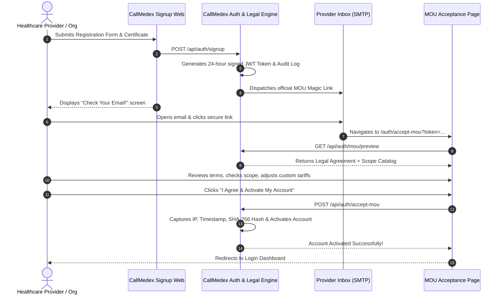

# CallMedex Universal Registration Manual
### End-to-End Onboarding Guide for All Platform Roles

> **Document Version**: 2.0 (Production Master)  
> **Target Audience**: Patients, Domestic Doctors, NRI Doctors, Dentists, Dietitians, Physiotherapists, Home Care Nurses, Phlebotomists, Healthcare Organizations (Hospitals, Polyclinics, Diagnostic Labs, Clinics), Pharmacies, and Administrative Staff.  
> **Purpose**: A self-service manual explaining the exact, step-by-step registration, verification, legal MOU execution, and account activation process for every participant on CallMedex.

---

## Table of Contents
1. [Platform Overview & Where to Register](#1-platform-overview--where-to-register)
2. [Quick Reference Matrix: All 11 Roles](#2-quick-reference-matrix-all-11-roles)
3. [General Rules & Document Requirements](#3-general-rules--document-requirements)
4. [Role-by-Role Registration Guides](#4-role-by-role-registration-guides)
   - [4.1 Patient & Family Member Registration](#41-patient--family-member-registration)
   - [4.2 Doctor (India / Domestic Practitioner) Registration](#42-doctor-india--domestic-practitioner-registration)
   - [4.3 NRI Doctor (Overseas Telemedicine Specialist) Registration](#43-nri-doctor-overseas-telemedicine-specialist-registration)
   - [4.4 Dentist & Dental Clinic Registration](#44-dentist--dental-clinic-registration)
   - [4.5 Dietitian & Clinical Nutritionist Registration](#45-dietitian--clinical-nutritionist-registration)
   - [4.6 Physiotherapist Registration](#46-physiotherapist-registration)
   - [4.7 Nurse (Home Healthcare & Clinical Care) Registration](#47-nurse-home-healthcare--clinical-care-registration)
   - [4.8 Phlebotomist (Home Sample Collector) Registration](#48-phlebotomist-home-sample-collector-registration)
   - [4.9 Healthcare Organization Registration (Hospitals, Polyclinics, Diagnostic Centers, Labs)](#49-healthcare-organization-registration-hospitals-polyclinics-diagnostic-centers-labs)
   - [4.10 Pharmacy & Chemist Registration](#410-pharmacy--chemist-registration)
   - [4.11 Front Desk & Administrative Staff Registration](#411-front-desk--administrative-staff-registration)
5. [The MOU (Memorandum of Understanding) & Commercial Workflow](#5-the-mou-memorandum-of-understanding--commercial-workflow)
6. [AI Document Verification & Anti-Rejection Checklist](#6-ai-document-verification--anti-rejection-checklist)
7. [Post-Registration Activation & First 24 Hours](#7-post-registration-activation--first-24-hours)
8. [Troubleshooting & Frequently Asked Questions (FAQs)](#8-troubleshooting--frequently-asked-questions-faqs)
9. [Official Escalation & Support Directory](#9-official-escalation--support-directory)

---

## 1. Platform Overview & Where to Register

CallMedex is India's unified, next-generation healthcare operating ecosystem connecting patients, verified medical practitioners, diagnostic processing centers, home healthcare teams, pharmacies, and major hospital networks.

### Official Registration Portals

| Platform Channel | Primary URL / Access Point | Best Suited For |
| :--- | :--- | :--- |
| **Web Portal (Universal)** | `https://callmedex.com/auth/signup` | All Doctors, NRI Specialists, Organizations, Pharmacies, Allied Healthcare Providers, and Patients |
| **Mobile Application** | CallMedex App on Android (Google Play) & iOS (App Store) | Patients, On-duty Phlebotomists, Home Nurses, and Doctors managing real-time consultations |
| **WhatsApp AI Assistant** | Verified CallMedex MediAssist WhatsApp Number | Instant Patient bookings, sample tracking, and automated record claims |
| **Partner Portal Login** | `https://callmedex.com/auth/login` | Return access for active accounts across all roles |

> [!IMPORTANT]
> **Activation Principle**:
> - **Patients** receive **instant, immediate account activation** upon registration.
> - **All Healthcare Providers & Organizations** go through a two-stage verification:
>   1. Submission of identity and statutory council/license certificates.
>   2. Electronic execution of the **Memorandum of Understanding (MOU)** with Scope of Services pricing delivered via secure email magic link.

---

## 2. Quick Reference Matrix: All 11 Roles

| Role Code | User Role | Primary Modality | Required Credentials | Commercial Split | Approval Mode |
| :--- | :--- | :--- | :--- | :--- | :--- |
| `patient` | **Patient / Caregiver** | Online, In-Clinic, Doorstep | Mobile No. or Email, Aadhaar / ABHA (Optional) | User pays standard fees | Instant Activation |
| `doctor` | **Indian Doctor** | Video Consult, Clinic, Home Visit | NMC / State Medical Council Registration, MBBS/MD Certificate | 80% Doctor / 20% Platform | AI OCR + MOU Acceptance |
| `doctor` *(NRI)* | **NRI Doctor** | Overseas Telemedicine Only | GMC, US State Board, DHA, AMC or Country Medical License | 80% Doctor / 20% Platform | AI OCR + MOU Acceptance |
| `dentist` | **Dentist** | Strictly In-Clinic Walk-in | State Dental Council Reg, BDS / MDS Degree | 80% Dentist / 20% Platform | AI OCR + MOU Acceptance |
| `dietitian` | **Clinical Dietitian** | Video Consult, Clinic, Home Visit | IDA Membership / Clinical Nutrition Master's Degree | 80% Dietitian / 20% Platform | AI OCR + MOU Acceptance |
| `physiotherapist` | **Physiotherapist** | Clinic Walk-in, Doorstep Rehab | IAP Registration / BPT / MPT Degree | 80% Physio / 20% Platform | AI OCR + MOU Acceptance |
| `nurse` | **Home Nurse** | Doorstep Clinical Procedures | State Nursing Council (INC) Registration Certificate | 80% Nurse / 20% Platform | AI OCR + MOU Acceptance |
| `phlebotomist` | **Sample Collector** | Doorstep Collection Route | DMLT / MLT Certificate, Govt Photo ID | Salaried or ₹150 / sample | PC Admin Review + MOU |
| `organization` | **Hospital / Lab / Clinic** | OPD, Inpatient, Diagnostics | Clinical Establishments Act Reg, NABL (for labs), GSTIN | Custom Contract / 80-20 | Super Admin Review + Institutional MOU |
| `pharmacy` | **Retail / Chemist** | Medicine Delivery, Counter Pickup | Drug License (Form 20/21), GSTIN, Pharmacist Reg | Custom Trade Terms | Verification + MOU Acceptance |
| `staff` | **Front Desk / Admin** | Linked to Hospital / Diagnostic Center | Organization ID Authorization, Employee Photo ID | Internal Org Payroll | Org Admin Approval |

---

## 3. General Rules & Document Requirements

### 3.1 Password Complexity Requirements
All accounts must adhere to healthcare security standards:
- Minimum **8 characters**
- At least one **uppercase letter** (`A-Z`)
- At least one **lowercase letter** (`a-z`)
- At least one **numerical digit** (`0-9`)
- At least one **special character** (`!@#$%^&*()_+-=[]{};':",.<>/?`)

### 3.2 Canonical State & District Selection
CallMedex routes phlebotomists, clinics, emergency dispatches, and diagnostics using standardized administrative districts.
- **Do not enter custom city nicknames** (e.g., enter `Visakhapatnam`, not `Vizag`).
- Choose your **State** and **District** from the official dropdown or click **"Detect My District via GPS"**.

### 3.3 Document Upload Specifications
- **Accepted Formats**: `PDF`, `JPEG`, `JPG`, `PNG`, `WEBP`
- **Maximum File Size**: **10 MB per file**
- **Clarity Requirement**: Full document must be legible, uncropped, with all four corners visible. Digital scans or crisp camera photos in good lighting are required for AI optical verification.

---

## 4. Role-by-Role Registration Guides

---

### 4.1 Patient & Family Member Registration

Patients can book doctor consultations, schedule home sample collections, order medicines, and store medical history in encrypted health lockers.

#### Who this is for:
- Individuals seeking healthcare services in India.
- NRI family members living overseas who want to manage and pay for their elderly parents' and relatives' care in India.

#### Step-by-Step Instructions:
1. Navigate to: `https://callmedex.com/auth/signup`
2. Select the **"Patient"** tile.
3. Fill in **Personal Information**:
   - **Full Name**: As per Aadhaar / Official ID.
   - **Gender**: Male / Female / Other.
   - **Date of Birth**: Day, Month, and Year.
   - **Email Address**: Your primary personal email.
   - **Mobile Number**: 10-digit Indian phone number (or international format with country code).
4. Set your **Password** and confirm it.
5. Select **Location Details**:
   - Select your **State** and **District**.
   - Enter complete Street Address and 6-digit Pincode.
6. Optional Clinical Details (Recommended for personalized triage):
   - **Blood Group**: A+, A-, B+, B-, AB+, AB-, O+, O-.
   - **Height (cm)** and **Weight (kg)**.
   - **Pre-existing Conditions**: Check BP, Sugar/Diabetes, Thyroid, Asthma, Heart Disease, Anemia, etc.
   - **Preferred Language**: English, Telugu, Hindi, Tamil, Kannada, etc.
7. Click **"Create Account"**.

> [!TIP]
> **WhatsApp Auto-Claim Feature**:
> If you have previously booked a diagnostic test or doctor consultation via the CallMedex WhatsApp assistant, **register with that exact same mobile number**. The system will automatically detect and link all past lab reports, doctor prescriptions, and medical histories to your new web dashboard immediately.

---

### 4.2 Doctor (India / Domestic Practitioner) Registration

For allopaths, general physicians, and clinical specialists practicing in India across solo clinics, polyclinics, or hospitals.

#### Prerequisites to Keep Ready:
- National Medical Commission (NMC) or State Medical Council Registration Number
- Degree Certificate (MBBS / MD / MS / DM / MCh / DNB)
- Clinic / Hospital Address and Consultation Fee details

#### Step-by-Step Instructions:
1. Go to `https://callmedex.com/auth/signup` and select the **"Doctor"** tile.
2. Fill in **Personal Information**: Full Name (e.g., `Dr. Arvind Sharma`), Gender, Date of Birth, Email, Mobile.
3. Select your **Practice Setting**:
   - **Solo Clinic**: Enter Clinic Name, Clinic Physical Address, and Clinic Phone.
   - **Polyclinic**: Enter Polyclinic Name and your Consultation Hours.
   - **Hospital Affiliated**: Enter Affiliated Hospital Name, Department, and Service Area.
4. Set **Consultation Mode**:
   - Select from: `In-Person Only`, `Online Video Consultation Only`, or `Both (Hybrid)`.
   - Check the box **"Available for Online Consultation"** if you want patient video calls.
5. Fill in **Professional Credentials**:
   - **Medical License Number**: Exactly as registered with State Medical Council / NMC.
   - **Primary Specialization**: (e.g., General Medicine, Cardiology, Pediatrics, Dermatology, Orthopedics).
   - **Highest Qualification**: (e.g., `MBBS, MD (Internal Medicine)`).
   - **Years of Clinical Experience**: Enter number of years.
6. Upload **Documents**:
   - Upload your **Medical Registration Certificate** (PDF or high-res photo).
   - Click **"Verify via AI"** to run instant credential OCR checking.
7. Set your **Password** and submit by clicking **"Register & Send MOU to Email"**.

#### What Happens Next:
- You will see the **"Check Your Email!"** screen.
- An email from `noreply@callmedex.com` containing your **24-hour secure MOU link** is sent to your registered email.
- Open the link, review your **80% provider commercial share**, review standard clinical covenants, and click **"I Agree & Activate My Account"**.
- Your account is now active! Log in at `https://callmedex.com/auth/login` to publish your appointment schedule.

---

### 4.3 NRI Doctor (Overseas Telemedicine Specialist) Registration

For Indian-origin and global medical specialists practicing abroad (USA, UK, UAE, Canada, Australia, Singapore, Europe, etc.) wishing to provide remote second opinions and video consultations to patients in India.

#### Prerequisites to Keep Ready:
- Overseas Medical License Number (e.g., GMC, California Medical Board, DHA, AMC, CPSO)
- Copy of Overseas Medical License / Specialist Board Certification
- Local Timezone details

#### Step-by-Step Instructions:
1. Go to `https://callmedex.com/auth/signup` and select **"Doctor"**.
2. Immediately check the toggle/checkbox: **"Are you an NRI / Overseas Doctor?"**
3. Configure your **Global Practice Details**:
   - **Country of Residence**: Select your country (e.g., United States, United Kingdom, United Arab Emirates, Canada, Australia, etc.).
   - **Timezone**: Select your working timezone (e.g., `America/New_York (EST)`, `Europe/London (GMT)`, `Asia/Dubai (GST)`). CallMedex automatically converts appointment slots to Indian Standard Time (IST) for patients.
   - **Overseas Licensing Authority**: Enter the body that issued your license (e.g., `General Medical Council (GMC) - UK`, `Texas Medical Board - USA`, `Dubai Health Authority (DHA)`).
   - **Overseas License Number**: Enter your foreign registration number.
4. Professional Information:
   - Specialization, Qualification (e.g., `MD, FACC, FRCP`), and Years of Practice.
5. Practice Mode Note:
   - For NRI Doctors, consultation mode is **locked to Online Telemedicine** to ensure cross-border regulatory compliance.
6. Upload your **Overseas Medical License / Specialist Certificate** and click **"Verify via AI"**.
7. Submit the form to receive the **NRI Cross-Border Teleconsultation MOU** in your email.
8. Review the international tele-guidelines and click **"I Agree & Activate My Account"**.

---

### 4.4 Dentist & Dental Clinic Registration

For dental surgeons (BDS) and dental specialists (MDS) operating physical dental clinics or dental hospital departments.

#### Mandatory Practice Rule:
> [!NOTE]
> **Dental consultations and procedures on CallMedex are strictly In-Clinic Walk-in**. No home dental visits or unsupervised remote dental procedures are permitted.

#### Step-by-Step Instructions:
1. Select the **"Dentist"** role tile.
2. Fill in Personal Details (Full Name, Gender, DOB, Email, Mobile).
3. Enter **Clinic Information**:
   - **Clinic Name**: (e.g., `Smile Care Dental Clinic & Implant Center`).
   - Clinic Physical Address, State, and District.
   - **Base Consultation Fee**: Default benchmark is ₹400 (customizable).
4. Fill in **Professional Credentials**:
   - **Dental License Number**: State Dental Council Registration.
   - **Highest Degree**: BDS or MDS.
   - **Specializations**: Check all applicable (General Dental Surgery BDS, Endodontics MDS, Orthodontics MDS, Prosthodontics MDS, Periodontics & Implantology MDS, Oral Surgery MDS, Pediatric Dentistry MDS).
5. Review **Standard 19 In-Clinic Dental Procedures**:
   - The platform will display the canonical procedure tariff list (Routine Cleanings, Digital X-Rays, Fluoride Treatments, Root Canal Therapy, Dental Crowns, Bridges, Dentures, Implants, Teeth Whitening, Veneers, Extractions, Wisdom Tooth Removal, Emergency Care).
   - You can uncheck any procedure your clinic does not perform.
6. Upload **Dental Registration Certificate** and run AI OCR check.
7. Click **"Register & Send MOU"**, open your email, review the 80/20 platform tariff split, and sign the digital agreement.

---

### 4.5 Dietitian & Clinical Nutritionist Registration

For qualified dietitians, therapeutic nutritionists, and clinical dietitians offering tele-dietetics, clinic walk-ins, and home nutrition audits.

#### Prerequisites to Keep Ready:
- IDA (Indian Dietetic Association) Membership Number or RD (Registered Dietitian) Certificate
- Master's / PG Diploma / B.Sc in Food & Nutrition / Clinical Dietetics
- Clinic / Consultation center name (if applicable)

#### Step-by-Step Instructions:
1. Select the **"Dietitian"** role tile.
2. Enter Personal Details, Mobile, Email, State, and District.
3. Select your **Dietetic Specializations**:
   - Clinical & Therapeutic Nutrition
   - Diabetes Medical Nutrition Therapy (MNT) & Insulin Resistance
   - Weight Management & Bariatric Diet
   - Cardiovascular & Lipid Control
   - Renal Dietetics (CKD / Dialysis)
   - Pediatric & Maternal Nutrition
   - Sports & Athletic Nutrition
   - PCOD / PCOS & Hormonal Balance
   - Gastrointestinal & Gut Health (IBS / GERD)
   - Oncology & Post-Op Nutrition
4. Fill in **Credentials**:
   - **Dietitian License / IDA Number**
   - **Qualification**: (e.g., `M.Sc Clinical Nutrition & Dietetics, RD`)
   - **Years of Experience**
5. Select service delivery modes: Online Tele-Diet, Clinic Visit, Home Visit.
6. Upload **Qualification / IDA Certificate**, execute the MOU via email link, and activate your account.

---

### 4.6 Physiotherapist Registration

For physiotherapists providing musculoskeletal rehabilitation, neuro-rehab, sports injury recovery, and post-surgical joint replacement therapy at clinics or at the patient's residence.

#### Step-by-Step Instructions:
1. Select the **"Physiotherapist"** role tile.
2. Fill in Personal Details, State, and District.
3. Select **Physiotherapy Specializations**:
   - Orthopedic & Musculoskeletal Rehab
   - Neuro-Rehabilitation (Stroke / Parkinson's)
   - Sports Injury & Return-to-Play
   - Spine, Sciatica & Posture Correction
   - Geriatric Mobility & Fall Prevention
   - Post-Surgical Joint Replacement Rehab
   - Pediatric Physiotherapy (CP / Milestones)
   - Cardiopulmonary Chest Physiotherapy
4. Fill in **Credentials**:
   - **Physiotherapist License / IAP Number** (Indian Association of Physiotherapists)
   - **Qualification**: (e.g., `BPT`, `MPT Orthopedics`, `MPT Neurology`)
   - Clinic / Center Name and Service Radius (default: 15 km for home visits)
5. Select consultation fees (Benchmark: ₹400 in-clinic / ₹800 home visit).
6. Upload **IAP Certificate / Degree**, click **"Verify via AI"**, submit, and complete the digital MOU via email.

---

### 4.7 Nurse (Home Healthcare & Clinical Care) Registration

For qualified nurses providing home nursing care, medication administration, wound dressing, post-operative care, and critical care support.

#### Clinical Boundaries:
> [!WARNING]
> All nursing procedures must be carried out in accordance with a valid registered medical practitioner's prescription. Independent diagnosis or unprescribed pharmacological prescription is strictly prohibited.

#### Step-by-Step Instructions:
1. Select the **"Nurse"** role tile.
2. Enter Personal Details, Gender, Date of Birth, Phone, Email, and District.
3. Fill in **Nursing License Details**:
   - **Nursing License Number**: Issued by State Nursing Council / Indian Nursing Council (INC).
   - **Qualification**: GNM (General Nursing and Midwifery), B.Sc Nursing, or Post-Basic B.Sc Nursing.
   - **Years of Nursing Experience**.
4. Select **Approved Nursing Services**:
   - Wound Dressing & Basic Wound Care
   - Injection Administration (IM / IV / SC)
   - IV Infusion Setup & Monitoring
   - Post-Operative Nursing Care
   - Catheter Care & Foley Catheterization
   - Elderly & Bedridden Geriatric Care
   - Pediatric Nursing
   - ICU / Critical Care at Home
5. Upload your **State Nursing Registration Certificate**.
6. Submit and verify via email MOU to enter the doorstep on-demand nursing roster.

---

### 4.8 Phlebotomist (Home Sample Collector) Registration

For trained laboratory technicians and phlebotomists who collect blood, urine, and diagnostic samples from patient homes and transport them under cold-chain compliance to CallMedex Processing Centers (PCs).

#### Employment Types on CallMedex:
1. **Full-Time Phlebotomist**: Salaried CallMedex employee assigned to a Processing Center. Receives monthly fixed salary + performance incentives.
2. **Part-Time / Freelance Phlebotomist**: Flexible per-collection partner earning **₹150.00 per completed patient home collection**.

#### Step-by-Step Instructions:
1. Select the **"Phlebotomist"** role tile.
2. Enter Personal Information and select your operating District.
3. Select **Employment Type**: `Full-Time` or `Part-Time`.
4. Enter **Technical Qualifications**:
   - **Certification / Registration Number**: Paramedical Council / DMLT / MLT registration.
   - **Qualification**: (e.g., `Diploma in Medical Laboratory Technology - DMLT`, `B.Sc MLT`).
   - **Years of Phlebotomy Experience**: (Minimum 1 year pediatric/geriatric venipuncture experience preferred).
5. Upload your **DMLT / MLT Certificate** and Government Photo ID (Aadhaar / Driving License).
6. Submit and complete MOU acceptance.
7. **Processing Center Assignment**:
   - Following registration, your local CallMedex City Supervisor will verify your kit (cold-chain transport box, vacutainer tubes, PPE, barcode scanner app) and assign your account to the nearest Processing Center (PC).

---

### 4.9 Healthcare Organization Registration (Hospitals, Polyclinics, Diagnostic Centers, Labs)

For institutions registering a facility, diagnostic chain, multi-specialty hospital, polyclinic, or nursing home.

#### Key Distinction: Authorized Registrant vs. Organization Entity
Because an organization is a legal corporate entity, the registration form captures two levels of data:
1. **Authorized Contact Person**: The individual filling out the form (e.g., Hospital Owner, Director, General Manager, Front Desk Lead).
2. **Organization Facility Details**: Legal entity name, registration number, physical address, and facility configuration.

#### Organization Types Supported:
- `Hospital`: Multi-department, inpatient, ICU, surgical suites, and emergency.
- `Polyclinic`: Multi-specialty outpatient doctor consulting center.
- `Diagnostic Center / Pathology Lab`: Blood testing, biochemistry, pathology, ultrasound, X-ray, CT/MRI scans.
- `Clinic`: Single-specialty medical center.
- `Nursing Home`: Inpatient residential recovery and nursing care.

#### Step-by-Step Instructions:
1. Select the **"Organization"** tile at `https://callmedex.com/auth/signup`.
2. Section 1 — **Authorized Contact Person**:
   - **Contact Person Full Name**: Enter your legal name.
   - **Designation / Registrant Role**: Select from `Owner / Proprietor`, `General Manager`, `Front Desk Manager`, `Administrative Staff`, or `Other`.
   - **Official Work Email**: (e.g., `admin@cityhospital.com`).
   - **Owner / Director Email**: If you are an administrative staff member, enter the Owner or Medical Director's email here so the formal institutional MOU is sent to them for legal signature.
   - **Contact Mobile Number**: Your direct mobile phone.
3. Section 2 — **Organization & Facility Information**:
   - **Organization Legal Name**: (e.g., `Apex Multi-Specialty Hospital & Diagnostic Hub`).
   - **Organization Type**: Choose Hospital, Polyclinic, Diagnostic Center, Clinic, etc.
   - **Clinical Establishment License Number**: State Health Dept / Municipal Registration.
   - **Year of Establishment**: (e.g., `2014`).
   - **Ownership Type**: Sole Proprietorship, Partnership, Private Limited, Trust, or Society.
   - **Head of Institution**: Name of Medical Superintendent / Chief Medical Officer.
   - **Operating Hours**: (e.g., `24 Hours / 7 Days` or `08:00 AM - 09:00 PM`).
   - **Emergency Phone Number** and **Alternate Contact Phone**.
4. Facility Capacities:
   - For Hospitals & Polyclinics: Total Number of Departments, Total Em脑panelled Doctors, Total Branches.
   - For Diagnostic Centers: **NABL Accreditation Number** (if accredited) and brief summary of test catalog.
5. Location & Address:
   - Complete facility address, State, District, and Pincode.
6. Upload **Organization Certificate**:
   - Clinical Establishment Act License or Municipal Trade License.
7. Click **"Register & Send MOU to Email"**.

#### Institutional MOU Workflow:
- The legal agreement is dispatched directly to the **Owner / Director Email**.
- The authorized representative reviews the terms, institutional fee schedule, and clicks **"I Agree & Activate My Account"**.
- The CallMedex Provider Operations Team runs an administrative check within 12–24 business hours to enable patient OPD booking and laboratory order dispatch.

---

### 4.10 Pharmacy & Chemist Registration

For retail chemists, hospital pharmacies, and licensed medical stores delivering prescription drugs and over-the-counter medical supplies.

#### Prerequisites to Keep Ready:
- Drug License Numbers (Form 20 and Form 21 issued by State Drug Control Authority)
- Registered Pharmacist-in-Charge details & State Pharmacy Council Registration Number
- GSTIN Registration Certificate

#### Step-by-Step Instructions:
1. Select the **"Pharmacy"** role tile.
2. Section 1 — **Registrant & Owner Details**:
   - Contact Person Name, Designation, Official Email, and Phone.
   - **Owner / Proprietor Name**.
   - **Registered Pharmacist-in-Charge Name**: Qualified B.Pharm/D.Pharm professional responsible for drug dispensing.
3. Section 2 — **Pharmacy Operations**:
   - **Pharmacy Name**: (e.g., `MedLife Chemist & Druggists`).
   - **Pharmacy Type**: Retail Pharmacy, Hospital In-House Pharmacy, or Clinic Pharmacy.
   - **Years of Operation**.
   - **Operating Hours**: (e.g., `07:00 AM - 11:00 PM`).
   - **24x7 Emergency Availability**: Toggle ON if your pharmacy operates day and night.
   - **Home Delivery Offered**: Toggle ON if you offer doorstep delivery.
   - **Delivery Radius (km)**: Enter standard coverage zone (e.g., 5 km, 10 km).
4. Section 3 — **Statutory Licenses**:
   - **Drug License Number**: Enter official Form 20/21 numbers.
   - **State Pharmacy Registration Number**: Pharmacist's registration.
   - **GST Number**: 15-character Goods & Services Tax Identification Number.
5. Location: Physical street address, landmark, State, District, and Pincode.
6. Upload **Drug License Certificate** and submit for digital MOU signing.

---

### 4.11 Front Desk & Administrative Staff Registration

For receptionists, patient coordinators, and billing executives employed by an existing CallMedex hospital, polyclinic, or diagnostic center.

#### Prerequisites:
- You must obtain the **Organization ID** of your employer facility from your Hospital Administrator.

#### Step-by-Step Instructions:
1. Select the **"Staff"** role tile.
2. Enter Personal Details: Full Name, Gender, Date of Birth, Email, Mobile, Address.
3. Enter **Administrative Role**:
   - **Linked Organization ID**: Paste the exact ID provided by your hospital administrator.
   - **Staff Designation**: Front Desk Executive, Patient Coordinator, Billing Lead, or Lab Receptionist.
   - **Department**: (e.g., OPD Reception, Radiology Counter, Central Billing).
   - **Years of Administrative Experience**.
4. Set Password and submit.
5. **Approval**: Staff accounts are linked to the parent organization and become functional as soon as the Hospital Administrator approves the staff request inside their Organization Portal.

---

## 5. The MOU (Memorandum of Understanding) & Commercial Workflow

Every healthcare professional and institutional partner on CallMedex operates under a standardized, legally binding **Memorandum of Understanding (MOU)** to protect patient rights, guarantee service quality, and establish clear commercial revenue splits.

### 5.1 The 24-Hour Secure Magic Link Workflow



### 5.2 Commercial Split Models

CallMedex operates on a transparent, doctor-first commercial split:
- **Provider Share: 80%**
- **Platform Technology & Infrastructure Fee: 20%**

#### The Two Settlement Mechanisms:
1. **Wallet Settlement Model (Default for Online / App Pre-paid Bookings)**:
   - 100% of patient payment is collected digitally via CallMedex.
   - The 20% platform fee is deducted automatically.
   - The 80% provider balance is credited directly to the Provider’s CallMedex Digital Wallet.
   - Wallet balances are automatically settled to the provider's verified bank account on a scheduled weekly or monthly cycle.
2. **Confirmation Fee Model (Default for In-Clinic Walk-Ins & Doorstep Services)**:
   - CallMedex collects a 20% platform booking confirmation fee from the patient at the time of reserving the appointment.
   - The remaining **80% balance is collected directly by the Provider / Clinic / Hospital from the patient** in cash, UPI, or card at the physical counter or at the doorstep.

### 5.3 Scope of Services & Tariff Customizer
During MOU review on the `/auth/accept-mou` page:
- Providers can view their role’s standard service catalog (e.g., General Consultation, Specialist Consultation, Home Visit, Procedure Fees).
- You can accept the benchmark rate (e.g., ₹400) or enter a **custom price** (e.g., ₹600).
- The portal immediately recalculates and displays your exact earnings:
  $$\text{Custom Price: ₹600} \longrightarrow \text{Provider Net Share (80%): ₹480} \;\;|\;\; \text{Platform Fee (20%): ₹120}$$

---

## 6. AI Document Verification & Anti-Rejection Checklist

CallMedex uses an automated optical character recognition (OCR) and credential validation pipeline powered by Gemini Vision AI and government council registry cross-checking.

```
       [ Upload Certificate: PDF/JPG/PNG ]
                       │
                       ▼
       [ Step 1: Pre-flight File Validation ]
         • MIME Type check (PDF, JPEG, PNG, WEBP)
         • File size check (< 10 MB and > 1 KB)
                       │
                       ▼
       [ Step 2: Optical AI OCR Extraction ]
         • Extracts Full Legal Name
         • Extracts Medical / Nursing / Pharmacy License No.
         • Extracts Issuing Council & Year of Issue
                       │
                       ▼
       [ Step 3: Strict Field Cross-Match ]
        ┌──────────────────────────────────────┐
        │  Match Name on ID == Signup Name     │
        │  Match License ID == Signup License  │
        └──────────────────────────────────────┘
                       │
          ┌────────────┴────────────┐
          ▼                         ▼
   [ Match Passed ]          [ Match Mismatch ]
          │                         │
          ▼                         ▼
   Proceed to MOU          Flagged for Manual Review /
   Dispatched to Email     Instant Rejection Alert
```

### The Top 5 Rejection Triggers (And How to Avoid Them)

| # | Common Mistake | Why AI Flags It | How to Prevent It |
| :-: | :--- | :--- | :--- |
| **1** | **Name Mismatch** | Name entered as `Rajesh Kumar` while license reads `Dr. Rajesh K. Varma`. | Type your name **exactly** as printed on your official council certificate. |
| **2** | **License Typo** | Entering state code incorrectly (e.g., `APMC12345` instead of `APMC/2018/12345`). | Double-check every slash, zero, and prefix against your printed certificate. |
| **3** | **Blurry / Cropped Upload** | Camera shot cuts off the official seal or registration council header. | Take photo top-down in bright light with all four corners of the document visible. |
| **4** | **Unrecognized File Format** | Uploading `.doc`, `.heic`, or screenshot with low resolution. | Export as a standard `.pdf` or take a clean `.jpg` / `.png`. |
| **5** | **Expired License** | Uploading provisional certificate that expired past 12 months. | Upload your permanent registration certificate or renewal receipt. |

---

## 7. Post-Registration Activation & First 24 Hours

Once your MOU is signed and credentials verified, complete these setup steps to start receiving bookings:

### Go-Live Checklist for Providers & Organizations:
- [ ] **Step 1: Log in to your Dashboard**
  - Visit `https://callmedex.com/auth/login` and log in with your email and password.
- [ ] **Step 2: Complete Profile & Upload Professional Photo**
  - Upload a professional headshot or hospital logo. Patients trust verified profiles with clear pictures.
- [ ] **Step 3: Configure Operating Hours & Calendar Slots**
  - Go to `Settings > Availability Slots`. Set your recurring consultation timings (e.g., Mon–Fri: 10:00 AM – 01:00 PM and 05:00 PM – 08:00 PM).
- [ ] **Step 4: Bank Account Linking for Automated Payouts**
  - Enter your Account Holder Name, Bank Account Number, and IFSC Code under `Finance / Wallet Settings` to receive weekly digital payouts.
- [ ] **Step 5: Download the Mobile App**
  - Install the CallMedex Mobile App on your phone to receive real-time push notifications when a patient books a consultation or an emergency home visit is requested.

---

## 8. Troubleshooting & Frequently Asked Questions (FAQs)

### Q1: I finished registration, but I didn't receive the MOU email. What should I do?
1. Check your **Spam**, **Junk**, and **Promotions** folders in your email client.
2. If 10 minutes have passed, visit `https://callmedex.com/auth/login` and attempt to log in. The system will detect your `pending_mou` status and display a **"Resend MOU Link"** button.
3. If an organization was registered, confirm whether the email was routed to the **Owner's Email** specified during signup.

### Q2: My MOU link says "This link has expired or is invalid".
For security, MOU tokens automatically expire after **24 hours**. Return to the login screen and click **"Resend Verification / MOU Link"** to generate a fresh link instantly.

### Q3: Can a doctor work across multiple hospitals or clinics on CallMedex?
Yes. A doctor can register as an independent practitioner and affiliate with multiple polyclinics or hospitals through their provider dashboard using the Organization Linking tool.

### Q4: Are NRI Doctors permitted to prescribe medications in India?
NRI doctors provide international second opinions, medical evaluations, and teleconsultations under the Telemedicine Practice Guidelines. Where local allopathic dispensing is required, prescriptions are co-validated in accordance with standard medical regulatory protocols.

### Q5: Can a hospital register multiple branches?
Yes. When registering as an **Organization**, specify the total branch count. Following approval, the hospital administrator can add branch locations, department rosters, and localized staff credentials from the Central Admin console.

### Q6: How do phlebotomists receive daily sample collection assignments?
Phlebotomists toggle their status to **"On Duty"** in the mobile app. The CallMedex Dispatch Engine automatically assigns nearby patient home sample collection requests based on GPS location and cold-chain route efficiency.

---

## 9. Official Escalation & Support Directory

For onboarding assistance, bulk hospital onboarding, or manual verification queries, reach out to the CallMedex Support Team:

- **Universal Helpdesk Email**: `onboarding@callmedex.com`
- **Partner Support Email**: `partners@callmedex.com`
- **Toll-Free Phone Support**: `1800-XXX-MEDEX` (08:00 AM – 08:00 PM IST)
- **WhatsApp Provider Desk**: Available via official CallMedex MediAssist Business Channel
- **Emergency Operations Center**: Available 24x7 for active ambulance and emergency hospital dispatches
