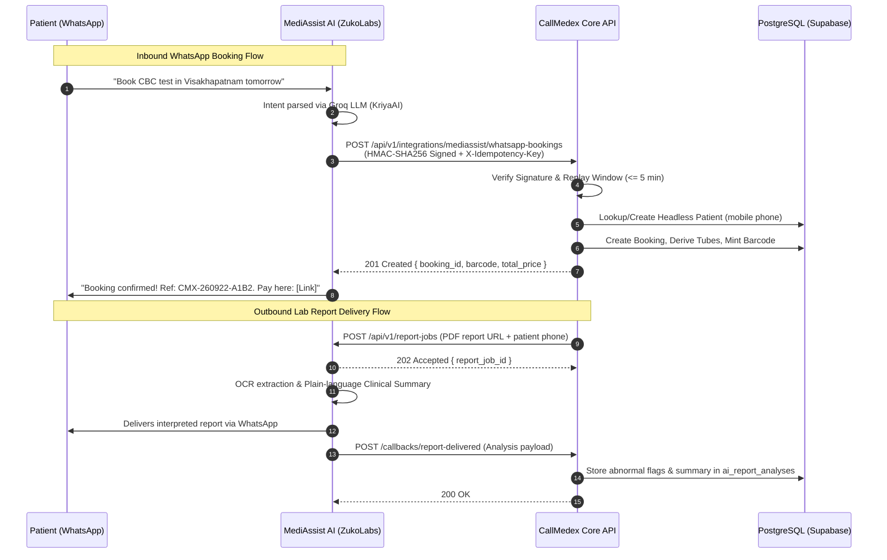

# 10 — WHATSAPP & MEDIASSIST INTEGRATION FORENSICS

**Document Version:** 1.0.0  
**Commit SHA:** `a7e8478e0e39d6b7a215fc9b5458c1ce0a321736`  
**Classification:** Messaging Ingress/Egress & External Bridge Audit  
**Verification Level:** STATICALLY VERIFIED against integration contracts, middleware, and routers  

---

## 1. THE ARCHITECTURAL PIVOT: MEDIASSIST AI BOUNDARY

Historic repository documentation (`CLAUDE.md`, Section 5) originally envisioned CallMedex maintaining a direct Meta WhatsApp Cloud API webhook handler inside FastAPI.

**Forensic Discovery:** That architecture was deliberately redesigned in August 2026.
As specified in `docs/integrations/mediassist-ai/README.md`:
> *"CallMedex owns Auth, Patients, Bookings, Payments, Processing Centers, Dispatch, Phlebotomist Operations, Barcode/Sample lifecycle. CallMedex must never implement Browser Automation, OCR, AI Summary, or WhatsApp messaging — that is MediAssist AI's exclusive responsibility. The two services talk ONLY over the REST contract below; there is no shared database access, no scraping, no direct Meta WhatsApp Cloud API usage from CallMedex."*

Consequently:
- CallMedex **does not maintain** any Meta WhatsApp Cloud API webhook credentials or direct WhatsApp senders.
- All WhatsApp message parsing, conversation state, NLP intent routing, and message delivery are delegated to **MediAssist AI** (`ZukoLabs` / `KriyaAI`).

---

## 2. CALLMEDEX ↔ MEDIASSIST REST CONTRACT

Communication between CallMedex and MediAssist AI is strictly bidirectional, signed, and idempotent:



---

## 3. CRYPTOGRAPHIC SECURITY SPECIFICATION

Both inbound and outbound HTTP requests adhere to an identical security scheme:

1. **Authorization Token:**
   `Authorization: Bearer <MEDIASSIST_BEARER_TOKEN>`
2. **HMAC-SHA256 Payload Signature:**
   Header: `X-Signature: sha256=<hex_digest>`
   Calculation: `HMAC-SHA256(timestamp + "." + raw_body, MEDIASSIST_HMAC_SECRET)`
   Verification: Recomputed on raw bytes and evaluated using `hmac.compare_digest` in `app/middleware/mediassist_auth.py`.
3. **Replay Protection:**
   Header: `X-Timestamp: <unix_epoch_seconds>`
   Rule: If `abs(current_time - timestamp) > 300` (5 minutes), request is rejected with `HTTP 401 Replay window expired`.
4. **Idempotency Enforcement:**
   Header: `X-Idempotency-Key: <UUIDv4>`
   Rule: Before executing mutations, the backend queries `mediassist_inbound_requests`. If the key exists, the cached JSON response is returned immediately with `X-Cache: HIT`.
5. **GET Request Integrity:**
   For `GET /patients/lookup`, `raw_body` is empty. The signature is computed over:
   `HMAC-SHA256(timestamp + "." + query_string, MEDIASSIST_HMAC_SECRET)`
   This prevents tampering with query parameters (e.g. altering `?phone=+919876543210` to enumerate patients).

---

## 4. INBOUND ROUTES IN CALLMEDEX (`app/routers/mediassist_inbound.py`)

| Endpoint | Ingress Payload | Behavior & Persistence |
| :--- | :--- | :--- |
| `POST /callbacks/report-processing` | `{ report_job_id, occurred_at }` | Transitions `report_jobs.status = 'processing'`. |
| `POST /callbacks/report-delivered` | `{ report_job_id, analysis: { summary, health_score, abnormal_flags } }` | Updates `report_jobs.status = 'delivered'`, stores clinical summary in `ai_report_analyses`. |
| `POST /callbacks/report-failed` | `{ report_job_id, failure_reason, details }` | Updates status to `'failed'`, raises ops alert if failure is due to corrupted file or timeout. |
| `POST /callbacks/notification-status`| `{ notification_id, status: 'delivered'\|'failed' }` | Updates delivery status in `notifications` table. |
| `POST /whatsapp-bookings` | `{ patient_phone, patient_name, test_code, district, collection_address }` | Provisions headless patient, creates booking, derives tubes, mints barcode. |
| `GET /patients/lookup` | Query: `?phone=+91XXXXXXXXXX` | Returns patient profile, past booking references, and active test statuses. |

---

## 5. OUTBOUND CLIENT (`app/integrations/mediassist_client.py`)

When CallMedex needs to trigger a WhatsApp message, it invokes `MediAssistClient`:

```python
# app/integrations/mediassist_client.py
await mediassist_client.send_notification(
    channel="whatsapp",
    recipient={"phone": patient_mobile},
    template="dispatch_arriving",
    template_data={
        "patient_name": "Ramesh Kumar",
        "phlebo_name": "Suresh Babu",
        "tracking_url": "https://callmedex.com/track/4f9c21..."
    }
)
```

### Outbound Reliability Parameters:
- **Connect Timeout:** 10.0 seconds (`MEDIASSIST_CONNECT_TIMEOUT_SECONDS`).
- **Total Timeout:** 20.0 seconds (`MEDIASSIST_TOTAL_TIMEOUT_SECONDS`).
- **Retries:** Exponential backoff, maximum 5 attempts (on 5xx, connection drop, timeout).
- **Circuit Breaker:** Opens after 5 consecutive failures; half-open probe after 30 seconds; closes after 2 consecutive successes.
