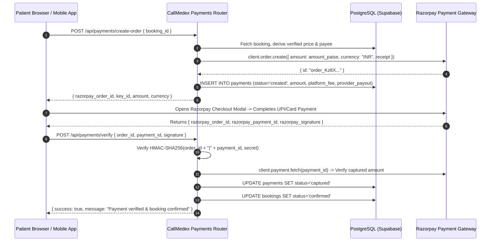

# 12 — PAYMENT & FINANCIAL TRANSACTION FORENSICS

**Document Version:** 1.0.0  
**Commit SHA:** `a7e8478e0e39d6b7a215fc9b5458c1ce0a321736`  
**Classification:** Financial Transaction Flow, Payment Gateway & Security Audit  
**Verification Level:** STATICALLY VERIFIED against payment service, router, and Celery tasks  

---

## 1. PAYMENT ARCHITECTURE & PROVIDER INTEGRATION

CallMedex integrates with **Razorpay** (`razorpay` Python SDK >= 1.4.0) to process Indian Rupee (INR) transactions for doctor consultations, diagnostic home collections, and nursing visits.



---

## 2. REVENUE RECOGNITION & 80/20 COMMISSION SPLIT

Every signed partner MOU fixes a standardized split:
- **Platform Commission:** **20%** (`PLATFORM_COMMISSION_RATE = 0.20`, dynamic override via `platform_settings`).
- **Provider Earnings:** **80%** credited to provider payout ledger.
- **Phlebotomist Exception:** Salaried full-time phlebotomists have a split rate of 0%; part-time collectors earn a flat incentive (default ₹150) per verified sample batch credited to `wallet_transactions`.

```python
# backend/app/services/payment.py (lines 196-200)
amount_paise = int(amount * 100)  # Razorpay uses paise
platform_fee = round(amount * _platform_fee_rate(), 2)
provider_payout = round(amount - platform_fee, 2)
```

---

## 3. SECURITY DEFENSES IN PAYMENT EXECUTION

1. **Client Price Tampering Defense:**
   In `app/routers/payments.py` (`create_order`), `body.amount` is optional and strictly cross-checked. The server re-evaluates the true price directly from the booking tests (`booking_tests`) or published provider tariff (`_resolve_provider_fee`). If a client modifies the DOM to send `amount: 1.00`, the server detects the mismatch and raises `HTTP 409 Conflict`.
2. **Payee Ledger Hijacking Defense:**
   The `provider_id` is resolved from `bookings.provider_id` on the server. If a malicious client passes another user's UUID in `body.provider_id`, the parameter is ignored, preventing earnings redirection.
3. **Cryptographic Signature Verification:**
   Signature verification in `PaymentService.signature_is_valid` calculates:
   `HMAC-SHA256(order_id + "|" + payment_id, RAZORPAY_KEY_SECRET)`
   and evaluates it against the client signature using `hmac.compare_digest` to prevent timing attacks.
4. **Server-Side Amount Cross-Check:**
   To prevent attacks where a patient pays for a ₹100 order against an open ₹5000 booking, `verify_payment` calls Razorpay's API (`client.payment.fetch(payment_id)`), converts paise to rupees, and asserts:
   `abs(stored_amount - captured_rupees) < 0.01`.
5. **Idempotency Guard Against Double Confirmation:**
   If `verify_payment` is submitted multiple times (e.g. rapid button taps or retry loops), the handler checks `payments.status`. If already `captured`, it immediately returns `{ duplicate: true, verified: true }` without repeating side effects or double-confirming bookings.

---

## 4. CRITICAL PAYMENT VULNERABILITIES & PRODUCTION GAPS

### Finding PAY-01: Absent Server-Side Razorpay Webhook (High Risk)
- **Severity:** High
- **Vulnerability Path:** Client Network Drop / Abandoned Browser
- **Technical Analysis:**
  CallMedex relies entirely on the **client-side redirect** (`POST /api/payments/verify`) to confirm payments.
  There is **no server-to-server Razorpay webhook listener** implemented in the backend (the route `/webhooks/razorpay` is declared in `SecurityMiddleware.SKIP_SANITIZE_PATHS`, but no router handler exists).
- **Failure Scenario:**
  1. A patient completes UPI payment on their phone. Razorpay successfully charges ₹1,200.
  2. Before the browser redirects back to CallMedex, the patient's phone enters an elevator or runs out of battery.
  3. Razorpay's server attempts to send an asynchronous webhook notification, but receives HTTP 404 from CallMedex.
  4. The booking remains in `pending` status indefinitely. The patient has been debited, but no phlebotomist or doctor is dispatched.
- **Required Mitigation:** Implement `POST /api/payments/webhook` with Razorpay webhook secret signature validation, plus an hourly Celery reconciliation sweep for `created` orders older than 30 minutes.

### Finding PAY-02: Commented-Out Automated Bank Settlements
- **Severity:** Medium
- **Location:** `backend/app/workers/tasks/payments.py` (lines 54–56)
- **Observed Code:**
  ```python
  # In production: initiate Razorpay Route transfer here
  # client.transfer.create({...})
  
  # Update payment to settled
  supabase.table("payments").update({"status": "settled"})...
  ```
- **Technical Impact:** The scheduled 2:00 AM Celery task marks transactions as `settled` in the local database and inserts rows into `settlements`, but **no funds are transferred to the provider's bank account**. Payouts are currently simulated in software and require manual bank NEFT/RTGS operations.
