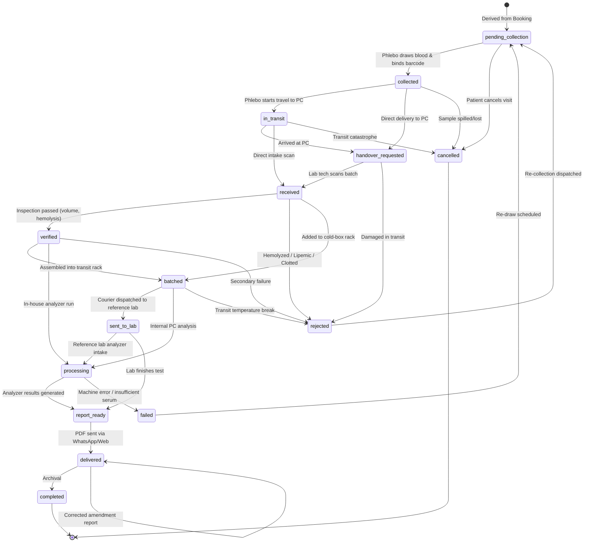
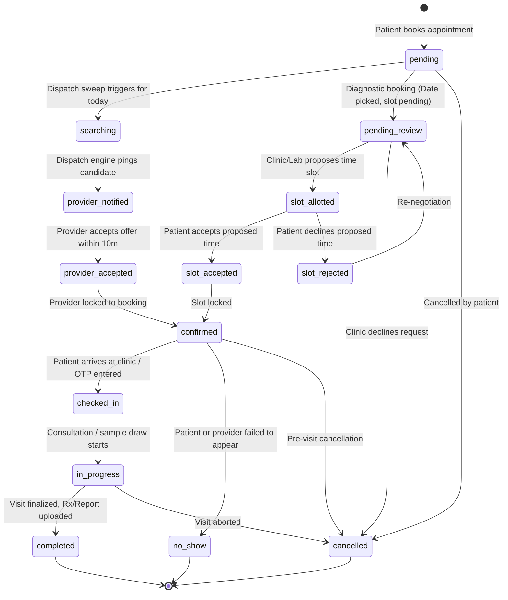

# 16 — STATE MACHINES & BUSINESS LIFECYCLES

**Document Version:** 1.0.0  
**Commit SHA:** `a7e8478e0e39d6b7a215fc9b5458c1ce0a321736`  
**Classification:** Business State Transition & Finite State Machine (FSM) Audit  
**Verification Level:** STATICALLY VERIFIED against FSM maps, validator functions, and schemas  

---

## 1. PHYSICAL SPECIMEN CUSTODY FSM (`app/services/samples.py`)

The chain-of-custody for physical blood and urine specimens is the most rigorously validated finite state machine in CallMedex. Defined in `backend/app/services/samples.py` (`ALLOWED_SAMPLE_TRANSITIONS`):



### FSM Enforcement Rule:
```python
# backend/app/services/samples.py
def validate_sample_transition(current_status: str, target_status: str) -> None:
    if not current_status or current_status == target_status:
        return
    allowed = ALLOWED_SAMPLE_TRANSITIONS.get(current_status, set())
    if target_status not in allowed:
        raise ValueError(
            f"Invalid sample state transition: '{current_status}' → '{target_status}'. "
            f"Allowed transitions from '{current_status}': {sorted(list(allowed)) or 'None (Terminal)'}"
        )
```
Every valid transition appends an immutable row to `sample_events` containing `sample_id`, `actor_id`, `role`, `event_type`, `lat`, `lng`, and `created_at`.

---

## 2. BOOKING LIFECYCLE FSM (`app/routers/bookings.py`)

The overarching healthcare appointment lifecycle supports both on-demand home services and scheduled clinic visits:



### State Audit Logging:
Whenever `bookings.status` changes, `_record_booking_history(booking_id, old_status, new_status, changed_by, notes)` writes a snapshot record to the `booking_history` table.

---

## 3. UNIVERSAL DISPATCH LIFECYCLE FSM (`app/services/dispatch_engine.py`)

Used for real-time tracking of nurses, phlebotomists, and home-visit doctors:

```text
searching
  │ (Provider notified via push/SMS)
  ▼
provider_notified
  │ (Provider taps "Accept Offer")
  ▼
provider_accepted
  │ (Provider taps "Start Navigation")
  ▼
en_route (Live tracking active via GPS tokens)
  │ (Provider arrives at patient geo-fence)
  ▼
arrived (OTP verification enabled)
  │ (Patient provides 4-digit OTP)
  ▼
in_progress (Specimen drawn / Nursing procedure conducted)
  │ (Procedure complete, signature/sample bound)
  ▼
completed (Billing finalized, wallet credit released)

Alternative Paths:
- At any point prior to arrived: -> cancelled
- If all 3 search rounds expire without acceptance: -> no_provider
```

---

## 4. PAYMENT TRANSACTION FSM (`app/services/payment.py`)

```text
created (Razorpay order opened via /api/payments/create-order)
  │
  ├──> captured (Client returns valid signature via /api/payments/verify)
  │      │
  │      └──> settled (Nightly Celery cron marks provider funds released)
  │
  ├──> failed (Card declined / UPI timeout on Razorpay)
  │
  └──> refunded (Admin initiates refund for cancelled booking)
```
