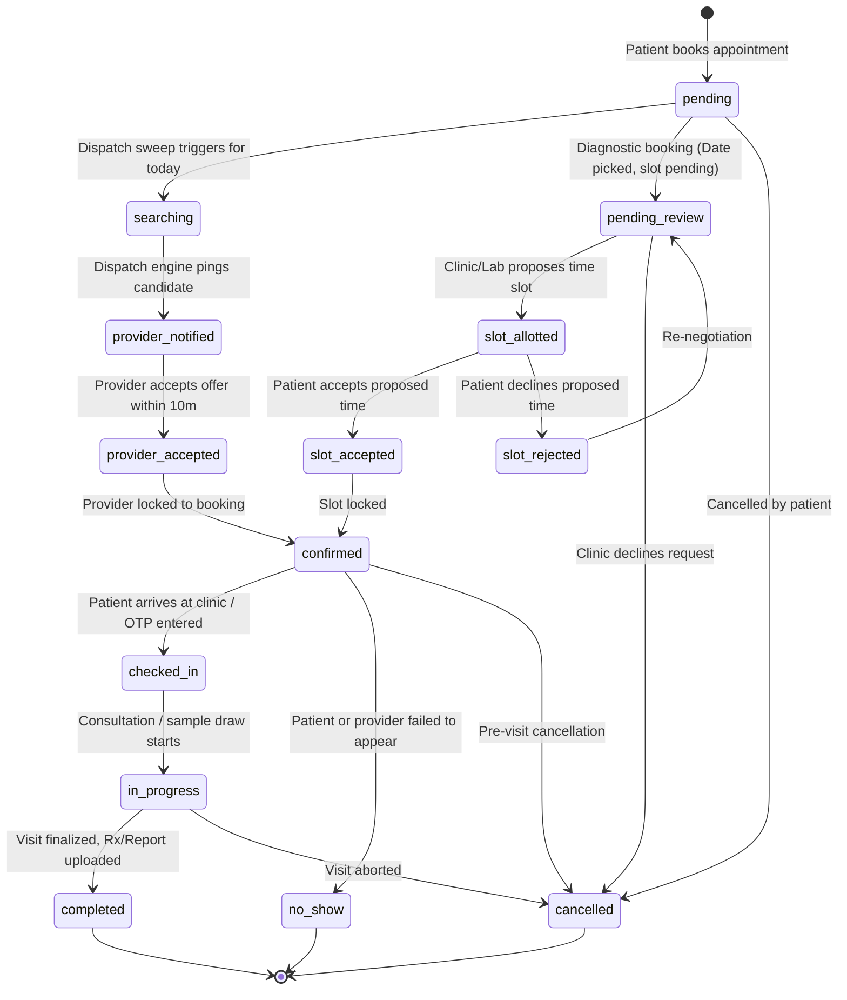

# 16 — STATE MACHINES & BUSINESS LIFECYCLES

**Document Version:** 1.0.0  
**Commit SHA:** `a7e8478e0e39d6b7a215fc9b5458c1ce0a321736`  
**Classification:** Business State Transition & Finite State Machine (FSM) Audit  
**Verification Level:** STATICALLY VERIFIED against FSM maps, validator functions, and schemas  

---

## 1. PHYSICAL SPECIMEN CUSTODY FSM (`app/services/samples.py`)

The chain-of-custody for physical blood and urine specimens is the most rigorously validated finite state machine in CallMedex. Defined in `backend/app/services/samples.py` (`ALLOWED_SAMPLE_TRANSITIONS`):

```mermaid
stateDiagram-v2
    [*] --> pending_collection: Derived from Booking
    pending_collection --> collected: Phlebo draws blood & binds barcode
    pending_collection --> cancelled: Patient cancels visit

    collected --> in_transit: Phlebo starts travel to PC
    collected --> handover_requested: Direct delivery to PC
    collected --> cancelled: Sample spilled/lost

    in_transit --> handover_requested: Arrived at PC
    in_transit --> received: Direct intake scan
    in_transit --> cancelled: Transit catastrophe

    handover_requested --> received: Lab tech scans batch
    handover_requested --> rejected: Damaged in transit

    received --> verified: Inspection passed (volume, hemolysis)
    verified --> report_ready: Report delivered via lab connector (MediAssist/KriyaAI); also from received/batched
    received --> rejected: Hemolyzed / Lipemic / Clotted
    received --> batched: Added to cold-box rack

    verified --> batched: Assembled into transit rack
    verified --> processing: In-house analyzer run
    verified --> rejected: Secondary failure

    batched --> sent_to_lab: Courier dispatched to reference lab
    batched --> processing: Internal PC analysis
    batched --> rejected: Transit temperature break

    sent_to_lab --> processing: Reference lab analyzer intake
    sent_to_lab --> report_ready: Lab finishes test

    processing --> report_ready: Analyzer results generated
    processing --> failed: Machine error / insufficient serum

    report_ready --> delivered: PDF sent via WhatsApp/Web
    delivered --> completed: Archival
    delivered --> delivered: Corrected amendment report

    rejected --> pending_collection: Re-collection dispatched
    failed --> pending_collection: Re-draw scheduled

    completed --> [*]
    cancelled --> [*]
```



### FSM Enforcement Rule:
```python
# backend/app/services/samples.py
def validate_sample_transition(current_status: str, target_status: str) -> None:
    if not current_status or current_status == target_status:
        return
    allowed = ALLOWED_SAMPLE_TRANSITIONS.get(current_status, set())
    if target_status not in allowed:
        raise ValueError(
            f"Invalid sample state transition: '{current_status}' → '{target_status}'. "
            f"Allowed transitions from '{current_status}': {sorted(list(allowed)) or 'None (Terminal)'}"
        )
```
Every valid transition appends an immutable row to `sample_events` containing `sample_id`, `actor_id`, `role`, `event_type`, `lat`, `lng`, and `created_at`.

---

## 2. BOOKING LIFECYCLE FSM (`app/routers/bookings.py`)

The overarching healthcare appointment lifecycle supports both on-demand home services and scheduled clinic visits:



### Home-collection booking ↔ dispatch sync (updated 2026-10-07)

Booking status follows the linked dispatch as follows (`UniversalDispatchEngine.update_status`, `accept_task`, `respond_to_offer`):

| Dispatch status | Booking status |
| :--- | :--- |
| `provider_accepted` (offer accepted / advance roster) | `provider_accepted` |
| `en_route`, `arrived` | `provider_accepted` (finer steps shown from the dispatch row) |
| `in_progress` (reached **only** via patient OTP) | `in_progress` |
| `completed` | `completed` |

Before this change, accepting an offer wrote booking `in_progress`. That showed the patient a visit in progress before anyone had left, blocked patient cancellation, and hid never-serviced bookings from `auto_expire_stale_bookings`.

Provider-originated transitions (`/status`, `/update-status`, `/magic-status`, OTP) are guarded in `update_status` by `PROVIDER_TRANSITION_PREREQS`: the caller must be the dispatch's `assigned_provider_id`, and only `provider_accepted→en_route→arrived→in_progress(OTP)→completed` is allowed.

`auto_expire_stale_bookings` now also sweeps past-dated `provider_accepted` / `in_progress` bookings. It keeps any booking with a non-pending tube in `samples` or a dispatch that reached `arrived`+, and cancels pending tubes with the booking.

Scheduled bookings with a time are refused (422) when the slot has passed. Home collection also needs `HOME_COLLECTION_LEAD_MINUTES` (30) of notice. Home slots are full at one booking per available collector in the city (`_home_slot_capacity`), not one per city.

### Collector assignment order (updated 2026-10-07)

Collectors are assigned automatically from the patient's location:

1. At booking time (`pick_advance_collector`).
2. By the evening roster pass.
3. By the same-day live offer (`trigger_dispatch_for_upcoming_bookings`), which also picks up jobs left `needs_manual_assignment` after everyone declined.

Radius is measured from each collector's base, which is anchored on their registered address at signup. `backend/scripts/rebase_phlebotomists.py` re-anchors existing collectors.

Every step needs the booking's `collection_lat/lng`. Locating works as follows (updated 2026-10-08):
- `geocode_address` tries Google, then Geoapify, then Nominatim. `GEOAPIFY_API_KEY` is now loaded in `config.py`; before this it was set on Render but never read.
- If the full address does not match, it retries with leading house or plot words dropped, down to the locality. It never falls back to the bare city.
- A booking saved without a location (geocoder outage or an unreadable address) is no longer skipped forever. `roster.ensure_collection_coords` re-geocodes it and saves the result in the roster pass, the same-day sweep and centre manual-assign. Before this change, such a booking was confirmed with no collector and nothing ever retried.

The processing-centre fallback for anything still unplaced is `GET /api/pc/unassigned-collections` plus `POST /api/pc/assign-collection` (centre admin). Rules:
- Suggestions are ranked free → in-radius → nearest to the patient.
- Assignment is refused while a live offer is still out.
- A failed auto dispatch row is reused (`assignment_mode='advance'`, so the collector can still decline through the normal reassign path).

### State Audit Logging:
Whenever `bookings.status` changes, `_record_booking_history(booking_id, old_status, new_status, changed_by, notes)` writes a snapshot record to the `booking_history` table.

---

## 3. UNIVERSAL DISPATCH LIFECYCLE FSM (`app/services/dispatch_engine.py`)

Used for real-time tracking of nurses, phlebotomists, and home-visit doctors:

```text
searching
  │ (Provider notified via push/SMS)
  ▼
provider_notified
  │ (Provider taps "Accept Offer")
  ▼
provider_accepted
  │ (Provider taps "Start Navigation")
  ▼
en_route (Live tracking active via GPS tokens)
  │ (Provider arrives at patient geo-fence)
  ▼
arrived (OTP verification enabled)
  │ (Patient provides 4-digit OTP)
  ▼
in_progress (Specimen drawn / Nursing procedure conducted)
  │ (Procedure complete, signature/sample bound)
  ▼
completed (Billing finalized, wallet credit released)

Alternative Paths:
- At any point prior to arrived: -> cancelled
- If all 3 search rounds expire without acceptance: -> no_provider
```

---

## 4. PAYMENT TRANSACTION FSM (`app/services/payment.py`)

```text
created (Razorpay order opened via /api/payments/create-order)
  │
  ├──> captured (Client returns valid signature via /api/payments/verify)
  │      │
  │      └──> settled (Nightly Celery cron marks provider funds released)
  │
  ├──> failed (Card declined / UPI timeout on Razorpay)
  │
  └──> refunded (Admin initiates refund for cancelled booking)
```
