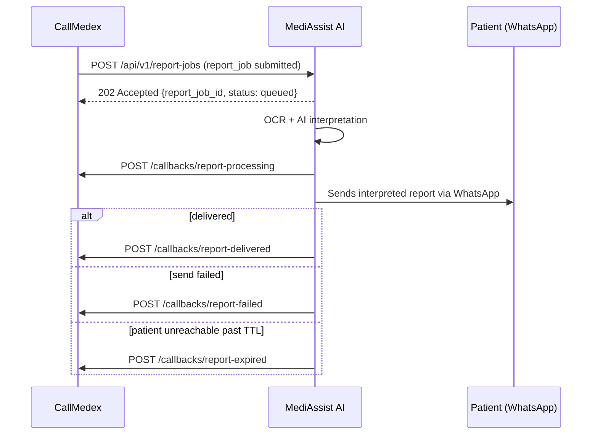
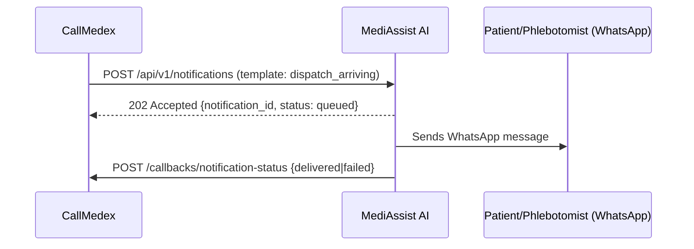
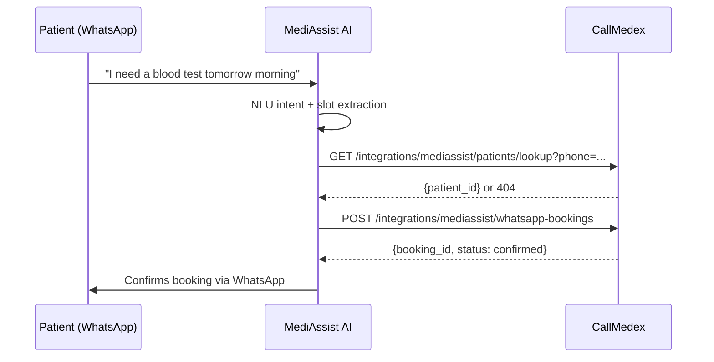

# CallMedex ↔ MediAssist AI Integration Contract

**Status:** Draft — step 1 of the WhatsApp/AI-report boundary rework.
**Owner of this repo's half:** CallMedex backend team.
**Not yet implemented in code.** These specs are the agreed interface; CallMedex-side
endpoints/clients are built against them in later steps.

## Why this exists

CallMedex owns Auth, Patients, Bookings, Payments, Processing Centers, Dispatch,
Phlebotomist Operations, Barcode/Sample lifecycle. CallMedex must never implement
Browser Automation, OCR, AI Summary, or WhatsApp messaging — that is MediAssist
AI's exclusive responsibility. The two services talk **only** over the REST
contract below; there is no shared database access, no scraping, no direct
Meta WhatsApp Cloud API usage from CallMedex.

Two documents define the boundary:

- [`mediassist-ai.openapi.yaml`](./mediassist-ai.openapi.yaml) — **MediAssist AI's**
  API surface. CallMedex's Integration Client calls these endpoints. Implemented
  by the MediAssist team; CallMedex conforms to it.
- [`callmedex-integration.openapi.yaml`](./callmedex-integration.openapi.yaml) —
  **CallMedex's** integration-facing API surface. MediAssist calls these
  endpoints to deliver callbacks and to forward WhatsApp-originated bookings.
  Implemented by CallMedex in a later step.

## Directional summary

| Direction | Purpose | Endpoints |
|---|---|---|
| CallMedex → MediAssist | Ask MediAssist to OCR/interpret a report and deliver it | `POST /api/v1/report-jobs`, `GET /api/v1/report-jobs/{report_job_id}` |
| CallMedex → MediAssist | Ask MediAssist to send a templated WhatsApp message (booking confirmed, dispatch arriving, payment receipt, reminder) | `POST /api/v1/notifications` |
| MediAssist → CallMedex | Report job lifecycle callbacks | `POST /api/v1/integrations/mediassist/callbacks/report-{processing,delivered,failed,expired}` |
| MediAssist → CallMedex | Notification delivery status callback | `POST /api/v1/integrations/mediassist/callbacks/notification-status` |
| MediAssist → CallMedex | Create a booking from a parsed inbound WhatsApp message | `POST /api/v1/integrations/mediassist/whatsapp-bookings` |
| MediAssist → CallMedex | Resolve a phone number to a known patient before booking/messaging | `GET /api/v1/integrations/mediassist/patients/lookup` |

## Security scheme (both directions, identical shape)

Every request in either direction carries:

- `Authorization: Bearer <service-to-service JWT>` — short-lived token issued by
  the receiving service to the calling service out of band (not user-facing
  auth, a separate service-credential exchange).
- `X-Signature: sha256=<hex>` — `HMAC-SHA256(timestamp + "." + raw_body, shared_secret)`.
  Receiver recomputes and compares with a constant-time check; reject on mismatch.
- `X-Timestamp` — Unix epoch seconds the request was signed at. Receiver rejects
  requests older than 5 minutes (replay protection).
- `X-Idempotency-Key` — caller-generated UUID, stable across retries of the
  *same logical operation*. Receiver stores `(idempotency_key -> first response)`
  and returns the cached response on a repeat, rather than reprocessing.
- `X-Correlation-Id` — propagated end-to-end across both services' logs for a
  single patient-facing action (e.g. one report-job flows: submit → processing
  callback → delivered callback, all sharing one correlation ID).

## Reliability conventions (CallMedex-side client, built in step 2)

- Retry: exponential backoff, max 5 attempts, only on 5xx/timeout/connection
  errors — never retry on 4xx (those are contract violations, not transient).
- Circuit breaker: open after 5 consecutive failures to a given endpoint,
  half-open probe after 30s, closed after 2 consecutive successes.
- Timeout: 10s connect, 20s total per attempt.
- All outbound calls and inbound callbacks are structured-logged with
  `correlation_id`, `idempotency_key`, status, and latency.

## Flow 1 — Report interpretation + delivery

## Flow 2 — Operational notification (booking/dispatch/payment)

## Flow 3 — WhatsApp-originated booking (dual front-door)

## Open items for the MediAssist team to confirm

1. Service-credential issuance mechanism (static per-environment secret vs. a
   token endpoint) — spec assumes a pre-shared bearer token + HMAC secret per
   environment until told otherwise.
2. Whether MediAssist wants a single unified `report-status` callback with a
   `status` enum instead of four separate endpoints — current draft follows
   the explicit "implement callback endpoints for delivered/failed/expired/processing"
   requirement literally as four endpoints.
3. Notification template catalog ownership — this draft defines an initial
   set (`booking_confirmed`, `dispatch_arriving`, `payment_receipt`,
   `appointment_reminder`, `phlebo_offer_new`) in `mediassist-ai.openapi.yaml`;
   MediAssist must confirm which templates it will actually render.
